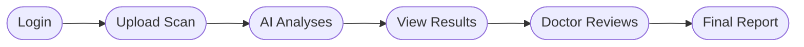

# ALDS — Pipeline Overview
**Advanced Lung Disease Screening**


ALDS helps doctors screen chest X-rays using AI. The AI finds potential lung problems. A doctor reviews and signs off.

---

                 ALDS — Advanced Lung Disease Screening
                         System Pipeline

 ┌─────────────┐
 │ Clinician   │
 │ / Hospital  │
 └──────┬──────┘
        │
        ▼
 ┌─────────────────┐
 │ Upload / Receive│
 │ DICOM / X-ray   │
 └────────┬────────┘
          │
          ▼
 ┌─────────────────┐
 │ Input Validation │
 │ Patient ID      │
 │ Format / Quality│
 └────────┬────────┘
          │
          ▼
 ┌─────────────────┐
 │ Preprocessing   │
 │ Resize / Normalize│
 │ Quality Check   │
 └────────┬────────┘
          │
          ▼
 ┌─────────────────────────┐
 │ AI Inference Service    │
 │ Lung Disease Model      │
 │ PyTorch / ML API        │
 └───────────┬─────────────┘
             │
        ┌────┴─────┐
        ▼          ▼
 ┌────────────┐ ┌──────────────┐
 │ Prediction │ │ Explainability│
 │ Probability│ │ Grad-CAM     │
 │ / Findings │ │ Heatmap      │
 └──────┬─────┘ └──────┬───────┘
        └──────┬───────┘
               ▼
       ┌────────────────┐
       │ Results Store  │
       │ PostgreSQL     │
       │ Object Storage │
       └───────┬────────┘
               │
               ▼
       ┌────────────────┐
       │ Radiologist    │
       │ Review         │
       │ Accept / Edit  │
       └───────┬────────┘
               │
               ▼
       ┌────────────────┐
       │ Final Report   │
       │ PDF / EHR/PACS │
       └───────┬────────┘
               ▼
          ┌──────────┐
          │ Archive  │
          └──────────┘

## 1. Workflow



| Step | Who | What |
|---|---|---|
| Login | Clinician | Sign in with hospital email |
| Upload | Clinician | Upload patient chest X-ray |
| AI Analysis | System | AI scans and finds lung issues |
| Results | Clinician | See AI predictions + heatmap |
| Review | Radiologist | Check findings, add notes |
| Report | Radiologist | Sign off and download PDF |

---

## 2. Data Input

Entered on the **Upload page**:

| Field | Example |
|---|---|
| Patient ID | `PX-4492-B` |
| Scan Date | `Oct 24, 2023` |
| X-ray file | `.dcm` (DICOM) or `.jpg` |

---

## 3. Pipeline Stages

| Stage | Page | What happens |
|---|---|---|
| Landing | `/` | Public info page, no login needed |
| Login | `/login` | Email + password check, 5 password rules |
| Upload | `/upload` | Upload X-ray, see queue status |
| AI Analysis | Backend | Cleans scan, runs model, creates heatmap |
| Results | `/results` | Shows confidence scores + coloured heatmap |
| Review | `/review` | Radiologist accepts or rejects each finding |
| Report | `/reports` | Final signed report, download as PDF |
| Archive | `/archive` | All past reports stored here |

---

## 4. Data Flow

```
Clinician uploads X-ray
       ↓
File saved to cloud storage
       ↓
AI picks up the job and analyses the scan
       ↓
Results saved to database
       ↓
Clinician sees results in browser
       ↓
Radiologist reviews and signs off
       ↓
Report saved to archive
```

---

## 5. Technologies Used

| What | Technology |
|---|---|
| Web app | Next.js + TypeScript |
| Styling | Tailwind CSS |
| AI model | PyTorch (lung disease detection) |
| Heatmap | Grad-CAM |
| Database | PostgreSQL |
| Cache & queue | Redis |
| File storage | AWS S3 / Google Cloud |

---

## 6. External Systems

| System | Purpose |
|---|---|
| ML Inference API | Runs the AI model |
| PostgreSQL | Stores scans, predictions, reports |
| Redis | Manages job queue and sessions |
| S3 / GCS | Stores X-ray files and heatmaps |
| MLflow | Tracks AI model versions |

---

## 7. Build & Deploy

```bash
npm install       # install packages
npm run dev       # run locally at localhost:3000
npm run build     # build for production
```

**Deployment:**
Push to GitHub → GitHub Actions checks code → Deploys to Vercel automatically.

---

## 8. Errors & Monitoring

| Where | Issue | How handled |
|---|---|---|
| Login | Bad email or weak password | Real-time validation, button disabled |
| Upload | Wrong patient ID | Warning message shown |
| Results | Low AI confidence | Disclaimer shown |
| Review | Unsaved notes | Auto-saved every 2 min |

**Monitoring tools:** Sentry (errors) · Datadog (performance) · CloudWatch (servers)

> The AI is a guide only. A radiologist must always give final approval.

---

*ALDS v0.1.0 · Next.js 16.3*
