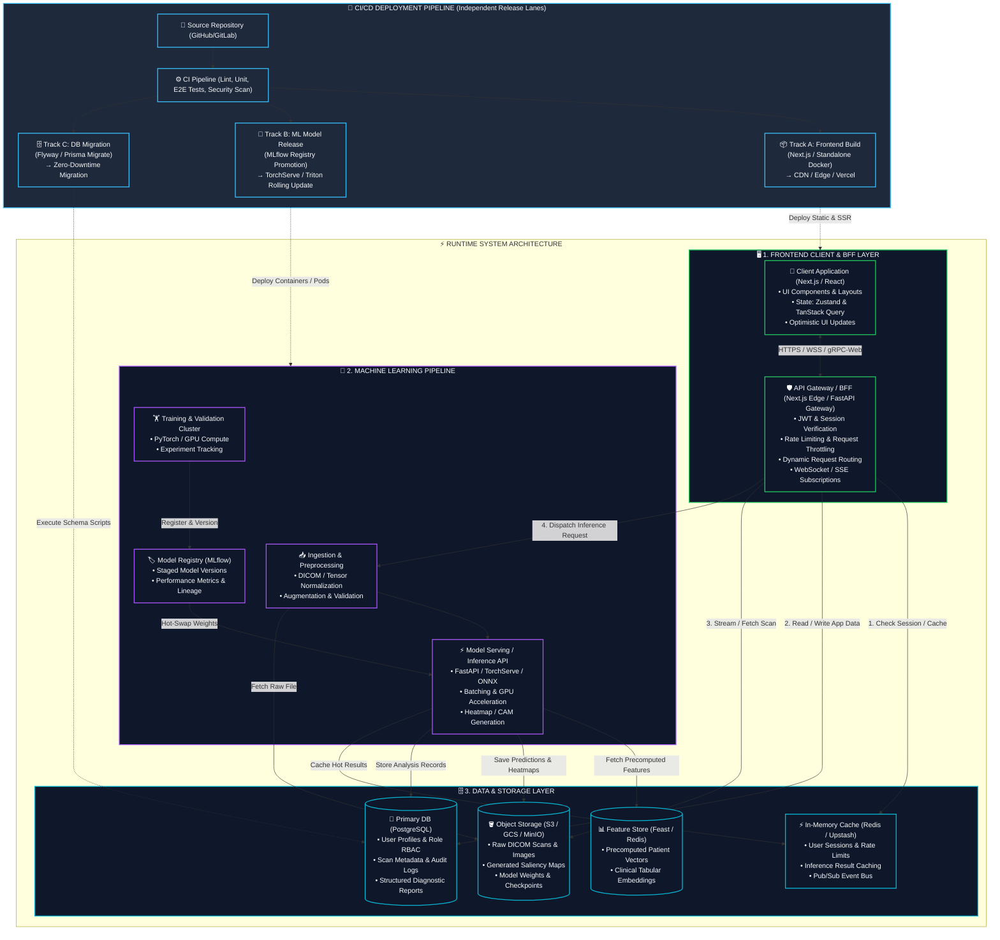
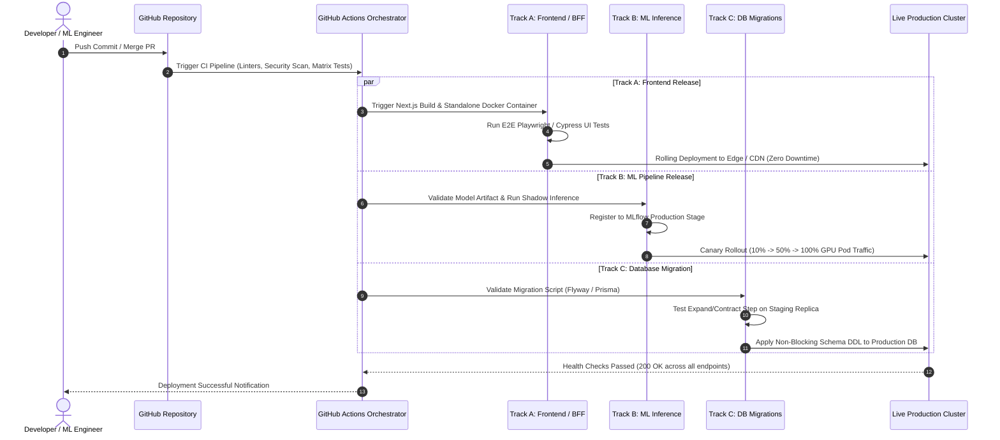

# Full-Stack System Architecture & CI/CD Pipeline (Antigravity Framework)


---

## 1. High-Level Architecture Overview



---

## 2. End-to-End Data Flow & Domain Breakdown

### Domain 1: Frontend Client (Primary Focus)

```
[User Browser]
      │
      ▼  (Encrypted HTTPS / WSS)
[React / Next.js Client Layer]
 ├── UI State Management (Zustand: local UI filters, viewer viewport state)
 ├── Server State & Caching (TanStack Query: background polling, stale-while-revalidate)
 └── DICOM & Image Canvas Viewer (CornerstoneJS / WebGL rendering)
      │
      ▼  (BFF Protocol)
[API Gateway / BFF]
 ├── 1. Authentication Layer (JWT validation, RBAC, OAuth2/OIDC)
 ├── 2. Security & Guardrails (CORS, Rate Limiter with Redis token bucket)
 ├── 3. Dynamic Router (Separates CRUD traffic from compute-heavy ML inferences)
 └── 4. Real-time Gateway (SSE / WebSockets for asynchronous inference progress)
```

#### Key Capabilities:
- **Optimistic Updates & Instant Feedback**: Diagnostic annotations and patient triage statuses reflect immediately with fallback rollback.
- **DICOM Streaming Support**: High-resolution image chunks are streamed directly from Object Storage via signed pre-authenticated URLs, bypassing the BFF compute layer to prevent memory bottlenecks.
- **BFF Abstraction**: Encapsulates microservice topology so the frontend interacts with a single unified, type-safe API boundary (`/api/v1/*`).

---

### Domain 2: Machine Learning Pipeline

```
[Inbound Scan Event / Request]
      │
      ▼
[Data Ingestion & Preprocessing Layer]
 ├── Header extraction (anonymizes patient PHI according to HIPAA/DICOM standard)
 ├── Format normalization (converts raw HU values / Windowing to standardized tensors)
 └── Data validation (rejects corrupt slices, out-of-distribution dimensions)
      │
      ▼
[Model Serving / Inference API (FastAPI + Triton / TorchServe)]
 ├── Dynamic Batching (groups incoming requests across concurrent users to maximize GPU utilization)
 ├── Multi-Task Prediction (Nodule detection, Opacity segmentation, Pneumothorax classification)
 ├── Explainability Engine (Generates Grad-CAM / Integrated Gradients heatmap overlays)
 └── Fallback & Guardrail Engine (Flags low-confidence predictions for mandatory radiologist verification)
      ▲
      │ (Continuous Model Delivery)
[Model Registry & MLOps Lifecycle]
 ├── MLflow / W&B: Tracks hyperparameters, F1-scores, ROC-AUC, model artifacts
 ├── GPU Retraining Cluster: Triggers on new verified clinical datasets
 └── Automated Canary Validation: Compares candidate model against production baseline before promotion
```

---

### Domain 3: Data & Storage Layer

| Storage Component | Technology | Primary Role | Read/Write Pattern |
| :--- | :--- | :--- | :--- |
| **Primary Transactional DB** | **PostgreSQL (with Timescale / pgvector)** | Stores user profiles, clinic roles, audit logs, screening metadata, and verified clinical notes. | High read concurrency, ACID transaction guarantees for medical compliance. |
| **In-Memory Cache & Bus** | **Redis Cluster** | Caches high-traffic endpoints, session states, and serves as the Pub/Sub bus for inference job status updates. | Sub-millisecond latency; LRU eviction with explicit TTL on token validation. |
| **Object Store** | **AWS S3 / GCS / Cloudflare R2** | Stores original DICOM scans, downsampled thumbnails, visual heatmaps, and ML model weights (`.pt`, `.onnx`, `.engine`). | Append-only, tiered lifecycle management (archive scans to cold storage after 90 days). |
| **Feature Store** | **Feast / Redis** | Stores precomputed spatial embeddings, historical patient biomarkers, and population baselines. | Low-latency feature retrieval during inference execution. |

---

## 3. CI/CD Deployment Pipeline (Independent Tracks)



### Why Independent Release Tracks Matter:
1. **Frontend Velocity**: UI/UX improvements, bugfixes, and styling changes deploy within 2 minutes without re-running long ML container builds or risking database locks.
2. **Safe ML Upgrades**: ML models undergo canary rollouts (shadow testing against live queries) and can be rolled back instantly via the Model Registry without rebuilding application code.
3. **Zero-Downtime DB Migrations**: Uses the **Expand-and-Contract Pattern** (adding columns first, backfilling, updating code, and dropping deprecated columns later) so database changes never cause frontend or ML API outages.

---

## 4. End-to-End Request Lifecycle Example

1. **Intake**: Clinician uploads a DICOM scan on the Next.js frontend.
2. **Direct Ingestion**: Client requests a signed upload URL from the BFF; file uploads directly to S3/GCS Object Storage.
3. **Queue & Process**: BFF enqueues an inference task in Redis. Preprocessing worker extracts pixel arrays and validates dimensions.
4. **GPU Execution**: Triton Inference Server pulls the tensor, runs inference with the active PyTorch model, and computes Grad-CAM heatmaps.
5. **Persistence & Cache**: Heatmap images are saved to Object Storage, prediction scores are written to PostgreSQL, and the result payload is cached in Redis.
6. **Real-time Push**: WebSocket event notifies the Frontend; UI automatically renders the annotated scan and structured diagnostic report.
